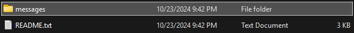

# Protect Your Privacy On Discord With Privcord (Windows)

## Introduction:

Discord has a lack of privacy related features making it difficult to actively monitor what information you have sent on discord. This python tool allows you to search through your messages with keywords or scan them for PII (Personally Identifiable Information) directly. It also helps you start the process for bulk message deletion as discord themself does not have a feature that allows users to delete all their messages at once.

## Requirements:

You must be using windows. This tool has not been tested on other systems; if someone wants to test it on other platforms/add cross platform support, please let me know and commit to this repository.

You must have python installed on your system to run this tool. To check if you have python installed, open up a command prompt window and type "python --version". If this command returns a version, you have python installed; if not, please watch this video on how to install python correctly: [Python Installation Guide](https://www.youtube.com/watch?v=YKSpANU8jPE).

You must also have your discord messages package.

To get your discord messages package:

1. Open Discord
2. Click on Settings
3. Click on Privacy & Safety
4. Scroll Down to the Bottom
5. Click On 'Request all of my data'
6. Check the 'Messages' Box Only
7. Confirm Your Choice
9. Wait to Get the Email
10. Download the Zip File
    

## Using The Tool

To start, download the tool from this repository. Then launch a terminal and navigate to the parent directory of the tool (type in "cd {path to parent directory}"). After being in the correct path, type in "python privcord.py" which should start the tool. The tool will provide instructions on what to do next, but they will also be included here.

1. Extract the Contents of the Zip File You Downloaded
2. Copy the File Path to the 'messages' Folder Inside the Extracted Folder (Right Click the Folder and Select "Copy as path")
3. Paste the File Path Into the Tool

If the path is valid. The tool will ask you which option you want to select (1. Search, 2. Scan, 3. Delete, 4. Exit). To select an option just type in the number associated with the option.

## Search Through Messages

The tool allows you to enter any number of search terms to check for in the messages. When you want to stop inputting search terms, just press space (NOTE: Messages that include only some of the search terms are not outputted. Messages have to have all search terms to be displayed). When you press space, the tool will spit out all the messages which have the terms and display three important bits of information.

  - Content of the Message
  - Exact Time the Message Was Sent
  - Where the Message Was Sent

However, please do note that sometimes the tool can't figure out where a message was sent. It could be that you left a server and don't have channel access anymore, or it could be that the message was sent in a deleted group chat (there are many possible scenarios).

## Scan Messages

As soon as this option is selected, the tool will output all PII it finds. It will look for common address, email, and phone number formats and display all detected messages. Each message will have the same output as "search" with the added detail of telling you what was detected (Ex. Address Match: Strong). The tool might not be able to detect all instances of PII because it uses flexible templates for detected. If some PII is in some wierd or obscure format, the tool will likely not detect it. If you are a developer and want to add more PII detection or more advanced PII detection, feel free to commit.

## Delete Messages

Since discord has no easy way to delete all your messages, this tool guides you through the process. Start by inputting the file path of the folder you want to store the csv file outputted by the tool (the csv file is a list of formatted message and channel ids to submit to discord for deletion). The tool should then start writing message/channel ids to a newly created messages.csv file. If there are any errors in this process, please create a new issue on this repository. Once done, you should be able to find the csv file in the directory you chose.

Then follow the steps:

1. Go to This Link: [Discord Support](https://support.discord.com/hc/en-us/requests/new?ticket_form_id=4750383925911)
2. Fill Out Your Email Address
3. Enter the Subject As: 'Bulk Discord Message Delete - {Your Discord Username}'
4. Make the Description Look Something Like This: [Example](https://github.com/victornpb/undiscord/discussions/429#discussioncomment-10312129)
5. Select 'Delete your personal data on Discord' under 'What do you need assistance with?'
6. Check the Box Asking if You Read the Articles
7. Upload the messages.csv File That This Tool Generated")
8. Press Submit
9. Wait
10. If Discord Does Not Take Action --> Check This Video: [How to Get Discord to Take You Seriously](https://youtu.be/g5FbRfwMEuo?t=691)

## Note

If there are any errors in this documentation or if the tool does not work as intended or if you have a new feature suggestion, please create a new issue describing the problem/idea.
